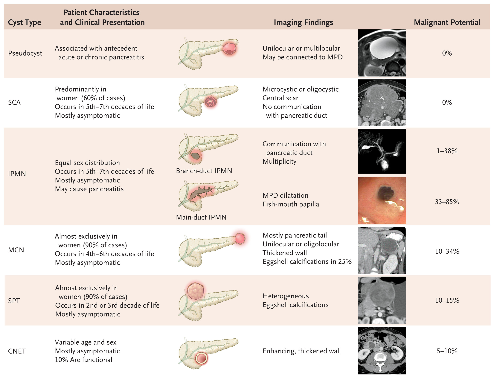

# Pancreatic Cysts

Pancreatic cysts are increasingly detected incidentally on cross-sectional imaging. Accurate characterization is essential given the variable malignant potential across cyst types.

---

## Overview by Cyst Type

---

## Cyst Fluid Analysis

### Tumor Markers by Cyst Type

| Marker | Serous Cystadenoma | Mucinous Cystic Neoplasm | IPMN | Pseudocyst |
|---|---|---|---|---|
| **Amylase** | Low | Low | High | High |
| **CEA** | Low | High | High | Low |
| **CA 72-4** | Low | High | High | Low |
| **CA 19-9** | Variable | Variable | Variable | High |
| **CA 125** | Low | Variable | Low | Low |

> CEA = Carcinoembryonic antigen; CA = Carbohydrate antigen

### Detailed Cyst Fluid Characteristics

| Feature | IPMN / MCN | Serous Cystic Tumors | Solid Pseudopapillary Tumors | Pseudocysts |
|---|---|---|---|---|
| **CEA** | Most accurate marker; variable levels; 192 ng/mL most accepted cutoff (84% specific, 75% sensitive); no association with malignancy | Low; < 5 ng/mL (95% specific, 50% sensitive) | Low; < 5 ng/mL; no reported cutoff levels | Low; < 5 ng/mL (95% specific, 50% sensitive) |
| **Cytology** | Mucin-containing columnar cells with variable atypia; highly specific (>90%) but insensitive (<50%) | Glycogen-rich cuboidal cells; yield <40% | Branching papillae with myxoid stroma; increased yield with solid component | No typical findings; inflammatory cells and debris may be present |
| **Mucins** | Positive staining (40% specific, 80% sensitive); MUC1 = invasive; MUC2 and MUC5A = noninvasive | No typical findings | No typical findings | No typical findings |
| **DNA / Molecular** | KRAS mutation specific for mucinous cysts (98% specific) | KRAS mutation absent | KRAS mutation absent | KRAS mutation absent |
| **Appearance & Viscosity** | Thick clear fluid — specific but not sensitive | Thin fluid; may be bloody | Often bloody | Thin brown fluid |
| **Amylase** | Variable; typically IPMN > MCN; no significant difference between mucinous and nonmucinous cysts | Low | Low | High; levels almost universally > 250 U/L |

> CEA = carcinoembryonic antigen; IPMN = intraductal papillary mucinous neoplasm; MCN = mucinous cystic neoplasm

---

## Key Differentiating Points

- **Pseudocyst vs. cystic neoplasm**: History of pancreatitis favors pseudocyst; high amylase + low CEA in fluid strongly supports pseudocyst
- **SCA vs. MCN**: SCA has low CEA and no mucinous epithelium; MCN has high CEA, ovarian-type stroma on pathology, and is almost exclusively in women
- **Branch-duct vs. Main-duct IPMN**: Main-duct involvement dramatically increases malignant risk (33–85%); fish-mouth papilla at ampulla is pathognomonic
- **MCN vs. IPMN**: MCN does not communicate with the pancreatic duct (unlike IPMN); MCN almost exclusively in women and typically in the pancreatic tail
- **SPT**: Young women, 2nd–3rd decade — this demographic alone narrows the differential significantly
- **CNET**: Enhancing wall on CT distinguishes from other cysts; 10% are functional (insulinoma, gastrinoma)

---

## Management Algorithm

<iframe src="../../content/pancreas/cyst-algorithm.html" style="width:100%;border:none;border-radius:8px;min-height:420px;" id="algo-frame" scrolling="no"></iframe>

---

## Cyst Surveillance

> For presumed IPMN or MCN with no high-risk stigmata. Surveillance should preferably be performed with the same imaging modality to maintain consistency in size measurements. Increase in cyst size defined as ≥3 mm/year.

<iframe src="../../content/pancreas/surveillance-algorithm.html" style="width:100%;border:none;border-radius:8px;min-height:420px;" id="surv-frame" scrolling="no"></iframe>

